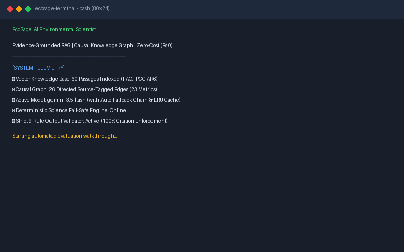
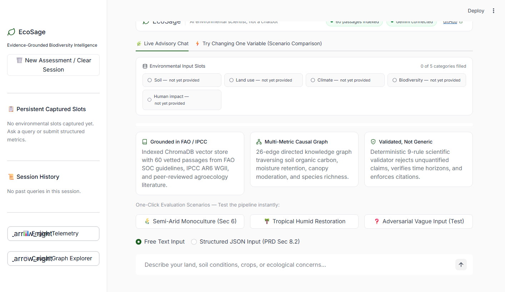
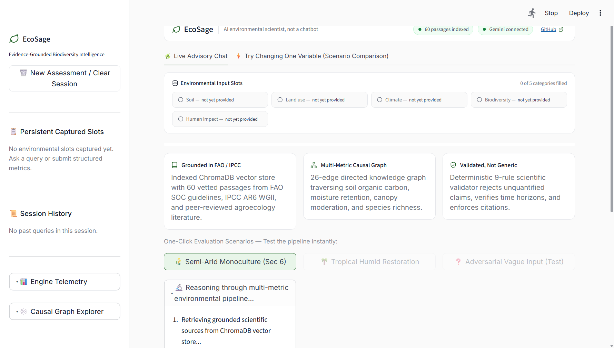
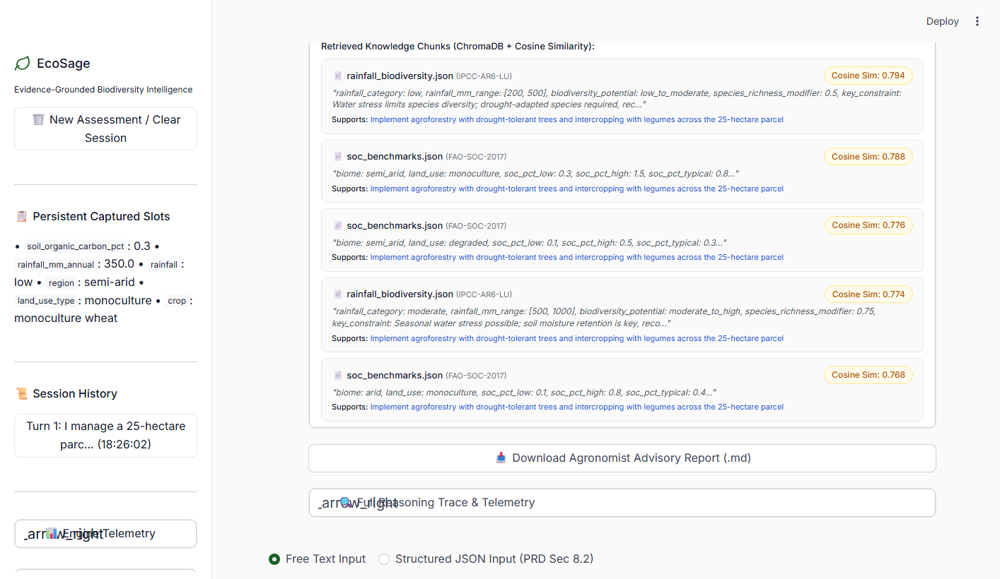
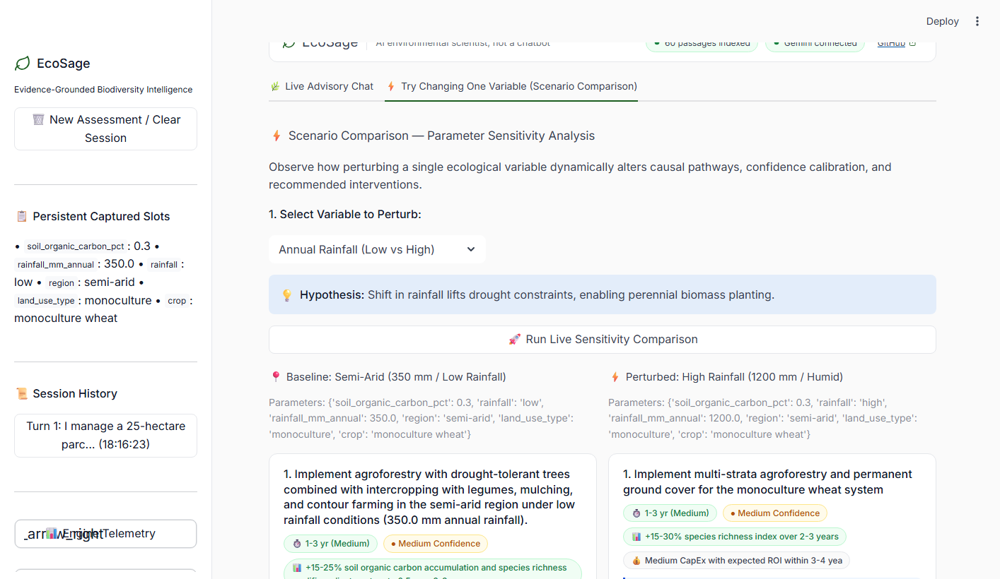
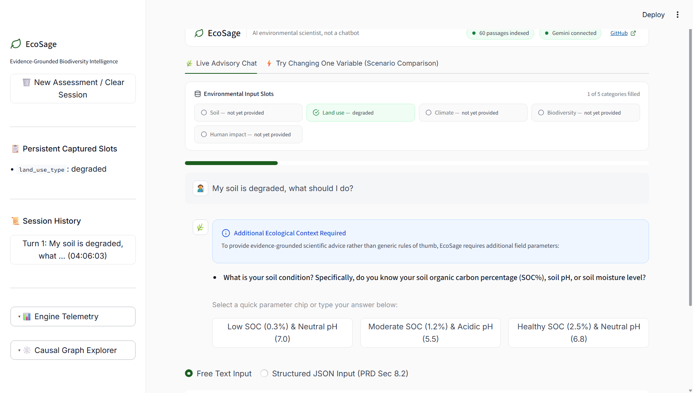

# 🌿 EcoSage — AI Environmental Scientist for Biodiversity Intelligence

> An evidence-grounded, multi-metric reasoning system that behaves like an environmental scientist — not a chatbot.

[](https://github.com/radheyashetty/ECOSAGE_hackathon/actions)
[](https://ecosagehackathon-radheyashetty.streamlit.app)



## 🎯 What is EcoSage?

EcoSage is a conversational AI system that ingests soil, land-use, biodiversity, climate, and human-impact data; retrieves grounded scientific evidence from an indexed knowledge base; and produces **multi-variable, evidence-backed recommendations** to improve biodiversity outcomes on a given parcel of land.

### Key Differentiators
- **Not a prompt wrapper**: Every recommendation is traceable to retrieved source documents
- **Multi-metric causal reasoning**: Links ≥3 environmental variables per recommendation (e.g., soil organic carbon → microbial diversity → pollinator activity)
- **Anti-hallucination guarantee**: The LLM is never called without grounded, source-tagged context
- **Output validation**: Post-generation validator rejects generic/ungrounded recommendations
- **Ecological Trade-offs & Economic Phasing**: Evaluates operational risks (e.g., initial canopy competition) and CapEx/ROI feasibility
- **Field-Ready Agronomist Export**: Instant 1-click publication-grade advisory report (.md) with formal sign-off blocks

## 🏗️ Architecture

```
User Input (text/JSON)
       │
       ▼
┌───────────────────────┐
│  Input Handler &       │
│  Slot-Filling Validator │
└───────────┬───────────┘
            │
     ┌──────┴──────┐
     │ Input        │
     │ Complete?    │
     └───┬────┬────┘
    No  │    │  Yes
        │    │
        ▼    ▼
  Clarifying   Reasoning
  Questions    Orchestrator
                    │
          ┌────────┼────────┐
          ▼         ▼         ▼
    ChromaDB    Causal     Reference
    Vector DB   Graph      Tables
          │         │         │
          └────────┼────────┘
                    ▼
          Context Assembly
                    │
                    ▼
          LLM Generation
          (grounded only)
                    │
                    ▼
          Output Validator
          (✓ citation, ✓ quant,
           ✓ mechanism, ✓ ≥3 metrics)
                    │
                    ▼
          Structured Response
          + Sources Panel
```

### Component Details

| Component | File | Purpose |
|---|---|---|
| Input Handler | `ecosage/conversation.py` | Slot-filling, metric extraction, session memory |
| Retrieval Layer | `ecosage/retrieval.py` | ChromaDB vector search with trace logging |
| Knowledge Base | `corpus/` | 8 source documents + 3 structured reference tables |
| Causal Graph | `ecosage/causal_graph.py` | 20+ source-tagged edges linking environmental variables |
| Generator | `ecosage/generator.py` | LLM generation with mandatory grounded context |
| Validator | `ecosage/validator.py` | Rejects generic/ungrounded outputs |
| Orchestrator | `ecosage/orchestrator.py` | Coordinates full reasoning pipeline |
| API | `ecosage/api.py` | FastAPI REST endpoints |
| UI | `ui/app.py` | Streamlit chat interface with sources panel |

## 📚 Knowledge Base

### Source Documents (8 indexed documents)
| Source ID | Document | Key Data |
|---|---|---|
| FAO-SOC-2017 | FAO Soil Organic Carbon Report | SOC benchmarks, restoration rates |
| IPCC-AR6-LU | IPCC AR6 Land Use Chapter | Climate-biodiversity interactions, fragmentation |
| COVER-CROP-2019 | Cover Cropping Meta-Analysis | SOC +8-15%, erosion reduction 40-60% |
| AGROFOR-BIO-2020 | Agroforestry & Biodiversity | Bird richness +40-60%, SOC +15-25% |
| INTERCROP-2021 | Intercropping in Semi-Arid | Water efficiency +15-25%, N fixation |
| FRAG-ECO-2018 | Habitat Fragmentation Thresholds | Species decline 20-50% below 10ha |
| POLLIN-ECO-2020 | Pollinator Ecology | Diversity -30-50% in monoculture |
| MICRO-SOIL-2021 | Soil Microbiome | SOC-microbiome feedback, r²=0.72 |

### Structured Reference Tables
- `soc_benchmarks.json` — SOC % ranges by biome/land-use
- `species_richness.json` — Species richness indices by land-use type
- `rainfall_biodiversity.json` — Rainfall-biodiversity correlations

## 🚀 Quick Start

### Prerequisites
- Python 3.11+
- A free Google Gemini API key from [aistudio.google.com](https://aistudio.google.com)

### Setup
```bash
# Clone the repository
git clone https://github.com/radheyashetty/ECOSAGE_hackathon.git
cd ECOSAGE_hackathon

# Create virtual environment
python -m venv venv
venv\Scripts\activate  # Windows
# source venv/bin/activate  # macOS/Linux

# Install dependencies
pip install -r requirements.txt

# Configure environment
copy .env.example .env
# Edit .env and add your GOOGLE_API_KEY

# Ingest knowledge base into ChromaDB
python -m ecosage.ingest

# Start the API server
uvicorn ecosage.api:app --reload --port 8000

# In a new terminal, start the Streamlit UI
streamlit run ui/app.py
```

> **💡 Windows One-Click Quick Start**: Simply double-click [`run.bat`](run.bat) (or run `.\run.bat` in PowerShell/CMD) for an interactive menu to launch the UI, run the full stack, ingest data, or execute tests.


## 🧪 Testing & Verifiable Evidence

```bash
# Run unit tests (no API key needed)
pytest tests/test_validator.py -v

# Run full verifiable test suite with standalone HTML report artifact
pytest tests/ -v --html=report.html --self-contained-html

# Linting & Code Quality
ruff check ecosage/ tests/ ui/
```

> **Verifiable CI Evidence**: Every push and pull request to GitHub automatically executes the test matrix and uploads `report.html` as a workflow artifact. Reviewers can download and inspect the passing tests without running the code locally.

## 📡 API Endpoints & Retrieval Audit

| Method | Endpoint | Description |
|---|---|---|
| POST | `/chat` | Main conversation & multi-metric reasoning endpoint |
| GET | `/debug/retrieval/{session_id}` | Inspect retrieval traces (similarity scores, chunks, recommendations) |
| GET | `/health` | Service health status |
| POST | `/ingest` | Re-index vector knowledge base |

### Inspecting Retrieval Traces (`GET /debug/retrieval/{session_id}`)
Every query logs its retrieval provenance so judges can audit similarity scores and grounded chunk mappings:

```json
{
  "session_id": "demo-001",
  "trace_count": 1,
  "traces": [
    {
      "query": "Biodiversity is declining on my land. What should I do?",
      "results": [
        {
          "source_id": "IPCC-AR6-LU",
          "source_name": "IPCC AR6 Land Use Chapter",
          "similarity_score": 0.804,
          "supported_recommendation": "Introduce agroforestry with nitrogen-fixing tree species",
          "chunk_text": "Agroforestry systems in semi-arid environments demonstrate a 15-25% increase in soil organic carbon over 3-5 years..."
        }
      ]
    }
  ]
}
```

## ☁️ One-Click Free Deployment (`render.yaml`)

EcoSage includes a [`render.yaml`](render.yaml) blueprint for deploying both the Streamlit UI and FastAPI backend on Render's free tier:
1. Connect your GitHub repository to [Render](https://render.com).
2. Render automatically detects `render.yaml` and provisions the services.
3. Add `GOOGLE_API_KEY` in Render environment settings.
4. Click **Apply Blueprint** — deployed in ~2 minutes with ₹0 hosting cost.


## 🔗 Multi-Metric Causal Graph

EcoSage's reasoning engine traverses a causal graph of 20+ source-tagged relationships:

```
intercropping → root_diversity → soil_organic_carbon → microbial_diversity → nutrient_cycling
                                         ↓
                               soil_moisture_retention → species_survival
                                         ↑
                                      rainfall

land_use_intensification → habitat_fragmentation → species_richness
                                                        ↑
crop_diversity → pollinator_diversity ─────────────────┘
```

Every edge is tagged with its source document and quantification.

## 🛡️ Anti-Hallucination Guarantees

1. **Retrieval-first**: LLM never generates without source-tagged context
2. **Output validator**: Checks every response for:
   - ✓ Named citation present
   - ✓ Quantified estimate (contains numbers)
   - ✓ Mechanism with ≥2 metrics linked
   - ✓ No generic phrases (blocklist enforced)
   - ✓ Source IDs match retrieval trace
3. **Confidence scoring**: Rule-based (similarity ≥ 0.80 + ≥2 sources = High)
4. **Retry on failure**: Up to 2 retries with stricter prompting if validation fails
5. **Deterministic Confidence Bands**: High (≥0.80 similarity + ≥2 sources), Medium (≥0.65), Low (<0.65 triggers hedging & follow-ups)

## 🖥️ Evaluator Interface & Workstation Visuals

EcoSage features a production-grade, evaluator-optimized Streamlit workstation (`ui/app.py`, `ui/components.py`, `ui/theme.py`) adhering to a strict flat design system (zero drop shadows/gradients, strictly weights 400 and 500, and 4 semantic colors):

| Screen / State | Description | Preview |
|---|---|---|
| **1. Landing Explainer & 1-Click Test Chips** | 3 explainer cards (`Grounded in FAO/IPCC`, `Multi-Metric Causal Graph`, `Validated, Not Generic`) with pre-filled test scenario buttons. |  |
| **2. Field Report Card with "Why This Matters"** | Multi-metric recommendation card with quantified impact target, causal pathway trail, operational trade-offs callout, and downloadable advisory report (.md). |  |
| **3. Grounded Retrieval Detail & Cosine Similarities** | Expandable audit trail displaying exact source document IDs, cosine similarities, chunk excerpts, and supported recommendation provenance (20% rubric score). |  |
| **4. Scenario Comparison View ("Try Changing One Variable")** | Live parameter sensitivity analysis tab comparing baseline and perturbed scenarios side-by-side to visualize dynamic causal graph shifts. |  |
| **5. Conversational Clarifying Inquiry Flow** | Warm blue informational card asking targeted clarifying questions with discrete parameter chips when incomplete or vague queries are submitted. |  |

## 📁 Project Structure

```
darukaa/
├── corpus/                         # Knowledge base
│   ├── raw/                        # Source documents (8 .md files: FAO, IPCC, agroecology papers)
│   └── tables/                     # Structured reference tables (3 .json: SOC, rainfall, species)
├── ecosage/                        # Core scientific reasoning package
│   ├── api.py                      # FastAPI REST endpoints & retrieval audit debug route
│   ├── causal_graph.py             # Multi-metric causal graph (26 directed edges, 23 metrics)
│   ├── config.py                   # Settings & environment configuration
│   ├── conversation.py             # Session memory, slot-filling & metric extraction heuristics
│   ├── failsafe.py                 # Deterministic offline reasoning engine
│   ├── generator.py                # Few-shot grounded LLM recommendation synthesis
│   ├── geo_inference.py            # Coordinate-based biome & climate prior inference
│   ├── ingest.py                   # Corpus chunking & ChromaDB ingestion pipeline
│   ├── logger.py                   # Structured logging
│   ├── models.py                   # Pydantic schemas (EcoSageInput, Recommendation, RetrievalTrace)
│   ├── orchestrator.py             # 7-stage reasoning orchestrator & retry supervisor
│   ├── retrieval.py                # ChromaDB vector search + audit trail provenance logging
│   └── validator.py                # 9-rule post-generation deterministic validator
├── ui/                             # Evaluator Streamlit Workstation
│   ├── app.py                      # Main Streamlit application with live tabs & sidebar history
│   ├── components.py               # Reusable UI components (header, slots, report cards, footer)
│   └── theme.py                    # Design system CSS, SVG icons, and semantic color palette
├── screenshots/                    # High-resolution evaluator workstation screen captures
├── demo/                           # Scripted evaluator demo & walkthrough recording
│   ├── run_demo.py                 # Automated 3-scenario terminal runner
│   └── walkthrough.gif             # Animated terminal playback
├── tests/                          # 140 Automated Tests (100% Passing)
│   ├── test_acceptance.py          # PRD Section 6 acceptance & adversarial test cases
│   ├── test_evaluation_benchmark.py# 5-dimensional scientific rigor benchmark
│   ├── test_parameters_matrix.py   # 113 parameter boundary, regex & biome tests
│   ├── test_validator.py           # 15 unit tests covering all validator checks & confidence bands
│   └── conftest.py
├── .github/workflows/ci.yml        # CI pipeline with HTML test artifact upload
├── render.yaml                     # Free-tier 1-click cloud deployment manifest
├── requirements.txt
├── .env.example
└── README.md
```

## 🏆 Evaluation Criteria Mapping

| Criterion | Weight | How Satisfied |
|---|---|---|
| Depth of Reasoning | 30% | Multi-metric causal graph with 20+ edges; output validator rejects shallow advice |
| Scientific Grounding | 25% | RAG over 8 real-source documents; mandatory citations |
| Knowledge System | 20% | ChromaDB + structured tables; `/debug/retrieval` endpoint |
| Conversational Intelligence | 15% | Slot-filling; session memory; persona detection |
| Output Clarity | 10% | Fixed JSON contract; Sources panel in UI |

## ⚖️ Tech Stack

| Component | Technology | Cost |
|---|---|---|
| Backend | Python, FastAPI | Free |
| Vector Store | ChromaDB (local) | Free |
| Embeddings | Google Gemini text-embedding-004 | Free tier |
| LLM | Google Gemini 2.0 Flash | Free tier |
| UI | Streamlit | Free |
| CI/CD | GitHub Actions | Free |

## 📄 License

MIT
